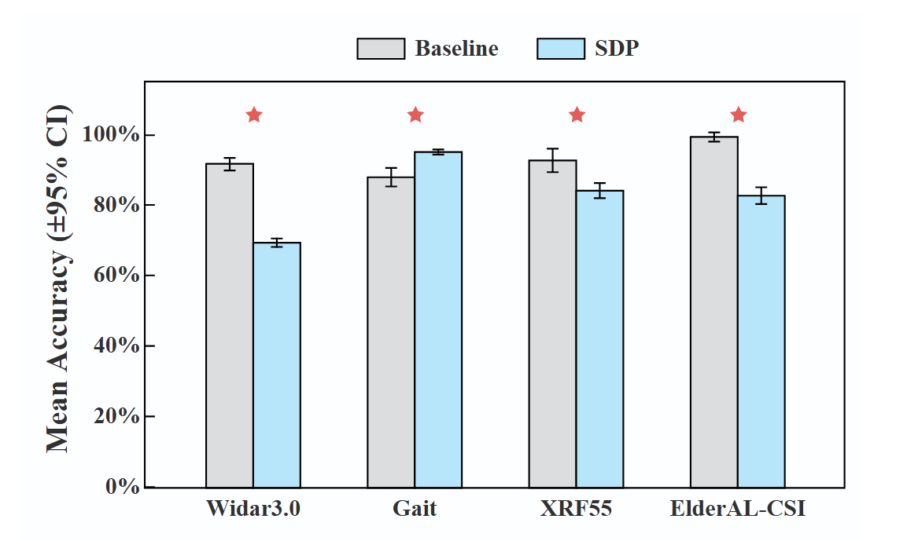
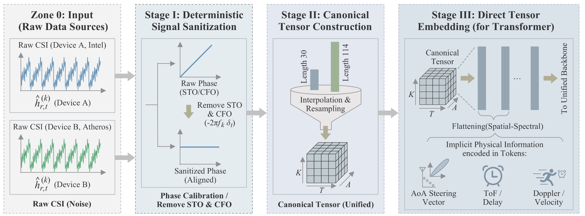

[](https://sdp8.org/)
[](https://pypi.org/project/wsdp/
)
[](https://github.com/yuanhao-cui/Sensing-Data-Protocol/blob/main/LICENSE)


# SDP: Sensing Data Protocol for Scalable Wireless Sensing

**SDP (Sensing Data Protocol)** is a protocol-level abstraction framework and unified benchmark for scalable wireless sensing and perception based on wireless signals such as Channel State Information(CSI).
The protocol is designed to decouple learning performance from hardware-specific artifacts, enabling **fair, reproducible, and scalable evaluation** of deep learning models for wireless sensing tasks.

SDP enforces **deterministic physical-layer sanitization, canonical tensor construction, and standardized training and evaluation procedures**, making it particularly suitable for wireless sensing research, activity recognition, device-free sensing, and cross-dataset benchmarking.

Our main result can be illustrated by the following pictures.

**Mean Top-1 accuracy with 95% confidence intervals over five runs**


**Performance stability comparison between the baseline and SDP across five random seeds. Boxplots show the distribution of Top-1 accuracy, with scattered dots indicating individual runs.**


**Rank consistency heatmap across five random seeds on the ElderAL-CSI dataset. Colors indicate per-seed performance rank (1 = best), with overlaid Top-1 accuracy values. Full SDP exhibits stable top-ranked performance, while ablated variants show higher ranking variability.**


More details are illustrated in our paper [A Sensing Dataset Protocol for Benchmarking and Multi-Task Wireless Sensing](https://arxiv.org/abs/2512.12180).

```
@misc{zhang2026sdpunifiedprotocolbenchmarking,
      title={SDP: A Unified Protocol and Benchmarking Framework for Reproducible Wireless Sensing}, 
      author={Di Zhang and Jiawei Huang and Yuanhao Cui and Xiaowen Cao and Tony Xiao Han and Xiaojun Jing and Christos Masouros},
      year={2026},
      eprint={2601.08463},
      archivePrefix={arXiv},
      primaryClass={eess.SP},
      url={https://arxiv.org/abs/2601.08463}, 
}
```

---

## 🔍 Why SDP?

Wireless sensing research often suffers from:
- Inconsistent **hardware configurations**
- Dataset-specific **preprocessing pipelines**
- Non-reproducible **training and evaluation protocols**

**SDP addresses these challenges at the protocol level**, rather than the model level. 
The SDP unified data processing pipeline, including sanitation and transformation, transform raw data into uniform canonical tensors ready for deep learning.

### Core Design Principles
- **Protocol-level abstraction**
- **Deterministic PHY-layer sanitization** to eliminate randomness
- **Canonical tensor representation** for deep learning compatibility
- **Unified benchmark pipeline** across datasets and tasks
- **Extensible architecture** for new datasets, processors, and models

---

## 📦 Key Features

- **Unified CSI abstraction** across heterogeneous datasets
- **Hardware-agnostic signal representation**
- **Modular reader–processor–model pipeline**
- **Deterministic preprocessing for reproducibility**
- **Plug-and-play extensibility**
- **Benchmark-ready training and evaluation flow**

---

## 📚 Target Use Cases

### SDP is optimized for:
- CSI-based **Human Activity Recognition (HAR)**
- **Gait recognition** and biometric identification
- **Wireless sensing + deep learning** research
- **Cross-domain / cross-hardware generalization**
- **scalable sensing systems**

Typical downstream models include CNNs, Transformers, BiLSTMs, GNNs, and hybrid architectures.

### Supported Dataset:

**Widar3.0**
 - Dataset Link: [Widar3.0: Wi-Fi-based Hand Gesture Recognition Dataset](http://sdp8.org/Dataset?id=028828f9-1997-48df-895c-9724551a22ae)
 - CSI Shape: (Time, 30, 1, 3)
 - num of classes: 6
 - total num of used samples: 12,000

**GaitID**
 - Dataset Link: [GaitID: Wi-Fi-based Human Gait Recognition Dataset](http://sdp8.org/Dataset?id=87a65da2-18cb-4b8f-a1ec-c9696890172b)
 - CSI Shape: (Time, 30, 1, 3)
 - num of classes: 11
 - total num of used samples: 22,500

 **XRF55**
 - Dataset Link: [XRF55: A Radio Frequency Dataset for Human Indoor Action Analysis](http://sdp8.org/Dataset?id=705e08e7-637e-49a1-aff1-b2f9644467ae)
 - CSI Shape: (270, 1000)
 - num of classes: 55
 - total num of used samples: 9,900

 **ElderAL-CSI**
 - Dataset Link: [ElderAL-CSI](http://sdp8.org/Dataset?id=f144678d-5b4a-4bb9-902c-7aff4916a029)
 - CSI Shape: (Time, 512, 3, 3)
 - num of classes: 6
 - total num of used samples: 2,400


---

## 📁 Project Structure Overview

### `algorithms/`

Store various functions for implementing different signal processing algorithms. 

- `./denoising.py`  
  Store functions for signal denoising
- `./phase_calibration.py`  
  Store functions for phase calibration

---

### `readers/`
- Store Dataset-specific readers
- Converts raw files into `List` of `CSIData`

---

### `structure/`
- Definition of `CSIData` and all kinds of `CSIFrame`

---

### `processors/`
 - Definition of processor for signal processing and sanitization

---

### `datasets/` 
 - Definition of classes extend `torch.utils.data.Dataset`

---

### `models/`
 - Definition of deep learning models

---


## 🚀 Quick Start

### Install Dependencies
Create a venv for dependencies, then run:
```bash
pip install wsdp
```

### Download Data
Please download needed datasets from [Our SDP Website](http://sdp8.org/) or via command:
```bash
wsdp download [dataset_name] [dir]
```
dataset_name must be `widar`, `gait`, `xrf55` and `elderAL`

After downloading, in the folder of your project, please organize **elderAL** datasets in the structure below for extracting labels:
```
├── data
    ├── elderAL
    │   ├── action0_static_new
    │   │   ├── user0_position1_activity0
    │   │   ├── ...
    │   │
    │   ├── action1_walk_new
    │   ├── ...
    │
    ├── widar
    ├── gait
    ├── xrf55
```

### Run
This project supports both functional call and command-line call in the shell. The calling methods are as follows respectively:

---
 - For `input_path`: `/data/[widar, gait, xrf55, elderAL]` are recommended
 - For `dataset_name`: `widar`, `gait`, `xrf55`, `elderAL` are available
---

**function call:**

Create a script, say script.py, then copy the code below and paste into the script:
```pycon
from wsdp import pipeline

pipeline(input_path, output_folder, dataset_name)
```

Considering that training process will generate numerous lines about information like acc and loss, in function-call, it is recommended to run via the command below:
```bash
nohup python script.py >> output.log 2>&1 &
```

**command:**

no need to create scripts, just run in command:

```bash
wsdp run [input_path] [output_folder] [dataset_name]
```
