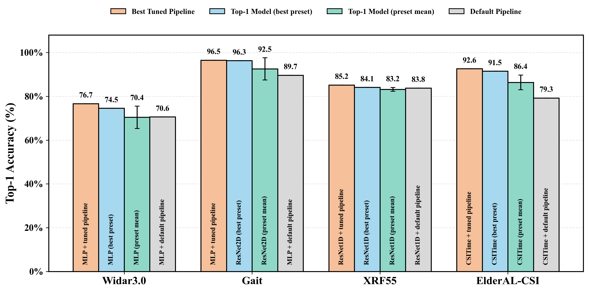

# SDP: Sensing Data Protocol for Scalable Wireless Sensing

<div align="center">

[](https://sdp8.org/)
[](https://pypi.org/project/wsdp/)
[](https://github.com/yuanhao-cui/Sensing-Data-Protocol/blob/main/LICENSE)
[](https://python.org)
[](https://pytorch.org)
[](https://docs.pytest.org)
[](https://yuanhao-cui.github.io/SDP-Sensing-Data-Protocol-for-Scalable-Wireless-Sensing/)
[](https://colab.research.google.com/github/yuanhao-cui/SDP-Sensing-Data-Protocol-for-Scalable-Wireless-Sensing/blob/main/examples/wsdp_tutorial.ipynb)

**Published and maintained by [SDP8.org](https://sdp8.org) — the official platform for reproducible wireless sensing.**

</div>

---

## 📖 Citation

If you use SDP in your research, please cite:

```bibtex
@ARTICLE{11652923,
  author={Zhang, Di and Huang, Jiawei and Cui, Yuanhao and Cao, Xiaowen and Han, Tony Xiao and Jing, Xiaojun},
  journal={IEEE Transactions on Mobile Computing},
  title={SDP: A Unified Protocol and Benchmarking Framework for Reproducible Wi-Fi Sensing},
  year={2026},
  volume={},
  number={},
  pages={1-14},
  keywords={Wireless fidelity;Modeling;Frequency;Protocols;Training;Streams;Accuracy;Measurement;Tensors;Antennas;Benchmark;canonical representation;channel state information (CSI);integrated sensing and communications (ISAC);reproducibility;wireless sensing},
  doi={10.1109/TMC.2026.3723025}}
```

---

<div align="center">

**[🇬🇧 English](README.md) | [🇨🇳 中文](docs/README_zh.md)**

</div>

---

## 🆕 What's New in v0.5.2

- **Modular algorithm pipeline** -- freely compose preprocessing steps with `AlgorithmStep` and `execute_algorithm_steps()`
- **Pluggable readers** -- bring your own file-format reader via `register_reader()` and `pipeline(..., reader=)` (CLI `--reader`)
- **Per-dataset pipeline presets** -- `widar`, `gait`, `xrf55`, `elderAL`, `zte` via `--algorithm-preset`
- **Compatibility & stability fixes** -- clearer errors when an algorithm doesn't support a dataset, checkpoint always saved, Python 3.9 fix, XRF55 subset split fix

---

## 🎯 What is SDP?

SDP is a **protocol-level abstraction** and unified benchmark for **reproducible wireless sensing**.

> ⚠️ **SDP is not a new neural network**, but a standardized protocol that unifies CSI representations for fair comparison.

## 🆚 Why Choose WSDP?

| Capability | WSDP | SenseFi (2023) | CSIKit |
|:----------:|:----:|:--------------:|:------:|
| **Built-in Models** | **19 (MLP→Mamba/GNN)** | 11 (MLP→ViT) | ❌ |
| **Preprocessing Algorithms** | **26+ (Wavelet, STC, etc.)** | ❌ | Basic |
| **Datasets** | **5** | 4 | ❌ |
| **Pluggable Architecture** | ✅ **Registry** | ❌ | ❌ |
| **Protocol Abstraction** | ✅ **Unique** | ❌ | ❌ |
| **Training Pipeline** | ✅ | ✅ | ❌ |
| **CLI** | ✅ **Full** | Basic | ✅ |

> *Verified from official GitHub repos on 2026-03-17.*

---

## 🧠 Model Zoo (19 Models, Baseline → SOTA)

<div align="center">

| Category | Models | Use Case |
|:--------:|:------:|:---------|
| **Baseline** | MLP, CNN1D, CNN2D, LSTM | Quick experiments, comparisons |
| **Mainstream** | ResNet1D, ResNet2D, BiLSTM+Attn, EfficientNet | Production use |
| **SOTA** | ViT, Mamba, GNN, CSIModel | Cutting-edge research |
| **Specialized** | THAT, CSITime, PA_CSI | Task-specific architectures |
| **Lightweight** | WiFlexFormer, AttentionGRU | Efficient deployment |
| **Cross-Domain** | EI, FewSense | Domain adaptation & few-shot |

</div>

```python
from wsdp.models import create_model, list_models
model = create_model("ResNet1D", num_classes=10, input_shape=(20, 30, 3))
```

> **⚠️ Baseline Model Architecture Note**
>
> Baseline models (MLP, CNN1D, CNN2D, LSTM) use a **Spatial Encoder** (Conv2d-based)
> to compress the `(F, A)` antenna dimension before temporal processing. This prevents
> parameter explosion from direct `(T, F, A)` flattening. See `CHANGELOG.md` for details.

---

## 🧪 Algorithm Library (26+ Algorithms in 7 Categories)

<div align="center">

| Category | Algorithms | Count |
|:--------:|:----------:|:-----:|
| **Denoising** | Wavelet, Butterworth, Savitzky-Golay, Bandpass, Hampel | 5 |
| **Phase Calibration** | Linear, Polynomial, STC, Robust | 4 |
| **Amplitude** | Z-Score, Min-Max, IQR Outlier, AGC Compensation | 4 |
| **Interpolation** | Linear, Cubic, Nearest, Anti-alias Decimate | 4 |
| **Features** | Doppler, Entropy, CSI Ratio, Tensor, Conjugate Multiply, PCA Fusion | 6 |
| **Detection** | Variance, Change Point | 2 |
| **Composition** | Pipeline presets, YAML config | - |

</div>

```python
from wsdp.algorithms import denoise, calibrate, normalize
denoised = denoise(csi, method='butterworth', order=5, cutoff=0.3)
calibrated = calibrate(csi, method='stc')
```

See [Model Guide](docs/models.md) and [Algorithm Guide](docs/getting-started/algorithm-guide.md).

---

## 🎯 What is SDP? (Cont.)

### The Problem

Wireless sensing research often suffers from:
- ❌ Hardware-specific CSI formats
- ❌ Inconsistent preprocessing pipelines  
- ❌ Unstable training results
- ❌ Large performance variance across random seeds

**Result**: Models cannot be fairly compared.

### The Solution

SDP solves this at the **protocol level**, not the model level:

| Feature | Raw CSI | Other Tools | **SDP** |
|:-------:|:-------:|:-----------:|:-------:|
| **Standardized Format** | ❌ Hardware-specific | ⚠️ Partial | ✅ **Unified CSIFrame** |
| **Multi-Dataset Support** | ❌ Manual parsing | ⚠️ 2-3 datasets | ✅ **5 datasets built-in** |
| **Preprocessing** | ❌ DIY | ⚠️ Basic only | ✅ **Wavelet + Phase Calib** |
| **Reproducibility** | ❌ Random | ⚠️ Varies | ✅ **5-seed standard** |
| **Deep Learning** | ❌ From scratch | ⚠️ Limited | ✅ **CNN+Transformer** |
| **CLI Interface** | ❌ None | ⚠️ Partial | ✅ **Full CLI support** |

SDP projects raw CSI into a fixed **canonical frequency grid (K=30)**, ensuring cross-hardware comparability.

### Performance Highlights

<div align="center">

| Metric | Result |
|:------:|:------:|
| **Accuracy** | SOTA on 5 datasets |
| **Reproducibility** | 5-seed evaluation standard |
| **Stability** | Low variance across runs |


*Figure 1: Accuracy comparison across datasets*


*Figure 2: Reproducibility and stability analysis*


*Figure 3: Ablation study results*


*Figure 4: Pipeline tuning versus model selection*

</div>

<p align="justify"><em>The orange bar is the best pipeline found by grid search over five preprocessing steps, tuned per dataset; all four winners use Savitzky-Golay denoising, with MLP on Widar3.0 and Gait, ResNet1D on XRF55 and CSITime on ElderAL-CSI. The blue and teal bars show the top model on its best preset and its mean over the six presets with standard deviation error bars, and the grey bar is the default pipeline. Tuning the pipeline gives larger gains than switching models.</em></p>

---

## 🚀 Quick Start (3 Steps, 5 Minutes)

### Step 1: Install (30 seconds)

```bash
pip install wsdp
```

Verify installation:
```bash
wsdp --version
```

### Step 2: Download Dataset (2 minutes)

> 🔑 **Required**: Create a free account at **[SDP8.org](https://sdp8.org)** — your account credentials are needed for dataset downloads.
>
> 🌐 **VPN is recommended** for downloading datasets.

**Option A: From CLI (Recommended for testing)**

All datasets hosted on **[SDP8.org](https://sdp8.org)**:

```bash
# elderAL = smallest dataset, fastest for testing
# Use your SDP8.org email/password:
wsdp download elderAL ./data --email you@example.com --password yourpassword

# Or use a JWT token (from SDP8.org dashboard):
wsdp download elderAL ./data --token YOUR_JWT_TOKEN

# Download larger datasets:
# wsdp download widar ./data
# wsdp download gait ./data
# wsdp download xrf55 ./data
# wsdp download zte ./data --email you@example.com --password yourpassword
# ⚠️ zte requires applying for access on the SDP platform first
```

**Option B: From [SDP8.org](https://sdp8.org) Web Interface**

Log in at [sdp8.org](https://sdp8.org) and download datasets manually.

**Required Dataset Structure:**
```
data/
├── elderAL/                    # Dataset name
│   ├── action0_static_new/     # Activity folder
│   │   ├── user0_position1_activity0/  # Sample folder
│   │   │   ├── sample1.csv
│   │   │   └── ...
│   │   └── ...
│   ├── action1_walk_new/
│   └── ...
├── widar/
│
├── gait/
│
├── xrf55/
│   └── WIFI/
│       └── sample.npy
└── zte/
```

### Step 3: Train & Evaluate (2 minutes)

**🐍 Python API (Recommended for research):**

Create `train.py`:
```python
from wsdp import pipeline

# Minimal call - uses default hyperparameters
pipeline("./data/elderAL", "./output", "elderAL")

# Or with custom hyperparameters
pipeline(
    input_path="./data/elderAL",
    output_folder="./output",
    dataset="elderAL",
    learning_rate=1e-3,
    num_epochs=50,
    batch_size=64,
)
```

Run:
```bash
python train.py
```

**💻 CLI (Quick & Simple):**

```bash
# Basic training
wsdp run ./data/elderAL ./output elderAL

# With hyperparameter override
wsdp run ./data/elderAL ./output elderAL --lr 0.001 --epochs 50 --batch-size 64

# With hyperparameter config file (YAML, top-level key = dataset name)
wsdp run ./data/elderAL ./output elderAL --config my_config.yaml

# Swap the model: a registered model name, or your own .py file
wsdp run ./data/elderAL ./output elderAL --model THAT
wsdp run ./data/elderAL ./output elderAL -m custom_model.py

# Custom preprocessing: algorithm config (YAML/JSON) or a preset
wsdp run ./data/elderAL ./output elderAL --algorithm-config my_algorithms.yaml
wsdp run ./data/elderAL ./output elderAL --algorithm-preset high_quality
```

**📊 What You Get:**

After training, check `./output/` (one set of files per random seed, 5 seeds by default):
```
output/
├── best_checkpoint_<seed>.pth    # Best model checkpoint for each seed
├── training_history_<seed>.csv   # Per-epoch loss & accuracy for each seed
└── cm_rs_<seed>.png              # Confusion matrix for each seed
```
Mean and variance of Top-1 accuracy across seeds are printed to the console at the end.

✅ **If you see these files, SDP is working correctly!**

---

## 📊 Supported Datasets

| Dataset | Format | Subcarriers | Complex | Scenarios | Size |
|:-------:|:------:|:-----------:|:-------:|:---------:|:----:|
| **Widar** | .dat (bfee) | 30 | ✅ | Gesture recognition | ~2GB |
| **Gait** | .dat (bfee, Intel IWL5300) | 30 | ✅ | Gait recognition | ~1GB |
| **XRF55** | .npy | 30 | ✅ | Human activity | ~3GB |
| **ElderAL** | .csv | varies | ❌ | Elderly activity | ~500MB |
| **ZTE** | .csv | 512 | ✅ | CSI with I/Q | ~4GB |

**More datasets coming soon!**

---

## 🔬 Research & Customization

### 🧠 Plug in Your Own Model

**Step 1:** Create `custom_model.py`:
```python
import torch
import torch.nn as nn

class YourCustomModel(nn.Module):
    def __init__(self, num_classes=6):
        super().__init__()
        # Your architecture here
        # Input shape: (Batch, Timestamp, Frequency, Antenna)
        
    def forward(self, x):
        # Your forward pass
        return output

# Required: expose model class
model = YourCustomModel
```

**Step 2:** Run with your model:
```bash
wsdp run ./data/elderAL ./output elderAL -m custom_model.py
```

### 📁 Use Your Own Dataset

Labels and split groups are parsed from **filenames**, so name your files after
one of the built-in dataset conventions (e.g. XRF55 `user_action_trial`) and pass
that dataset name. If your files use a custom format, register a reader for it:

```python
from wsdp import pipeline
from wsdp.readers import BaseReader, register_reader

class MyReader(BaseReader):
    def sniff(self, file_path): return file_path.endswith(".myfmt")
    def read_file(self, file_path): ...  # parse the file into CSIData

register_reader("my_format", MyReader)
# Filenames follow the XRF55 convention -> dataset="xrf55" + custom reader for the format
pipeline("./data/my_dataset", "./output", "xrf55", reader="my_format")
```

End-to-end example: [`examples/scripts/custom_reader_algorithm.py`](examples/scripts/custom_reader_algorithm.py).

### 🗺️ Codebase Map

Want to go deeper? Here's where to modify:

| Directory | Purpose | What to Modify |
|:---------:|:-------:|:--------------:|
| `models/` | Architectures | Define or compare model architectures |
| `algorithms/` | Signal Processing | Denoising, calibration, etc. |
| `datasets/` | Dataset Wrappers | Add new dataset loaders |
| `readers/` | File Readers | Add new format parsers |
| `structure/` | Data Structures | Modify CSIFrame format |
| `processors/` | Protocol Logic | Adjust canonical projection |

### 🔌 Pluggable Algorithm Architecture

WSDP features a **Registry Pattern** that makes algorithms pluggable:

```python
from wsdp.algorithms import denoise, calibrate, register_algorithm

# Unified API — switch methods with one parameter
denoised = denoise(csi, method='butterworth', order=5)
calibrated = calibrate(csi, method='stc')

# Register your own algorithm
def my_denoise(csi, **kwargs):
    return my_custom_filter(csi)

register_algorithm('denoise', 'my_method', my_denoise)
result = denoise(csi, method='my_method')  # Works like built-in!
```
You can try this in `examples/getting_started.ipynb` or just in your custom pipeline!

**Configuration file support:**

```yaml
# examples/configs/algorithms_config.yaml
denoise:
  method: butterworth
  params:
    order: 5
    cutoff: 0.3
calibrate:
  method: stc
normalize:
  method: z-score
```

```python
from wsdp.algorithms import load_config, execute_pipeline
config = load_config('examples/configs/algorithms_config.yaml')
processed = execute_pipeline(csi, config)
```
Or:
```python
pipeline(
    "./data/elderAL",
    "./output",
    "elderAL",
    algorithm_config_file='./examples/configs/algorithms_config.yaml',
)
```

**Pipeline presets:**

```python
from wsdp.algorithms import apply_preset, execute_pipeline

# Choose a preset for your use case
steps = apply_preset('high_quality')  # or 'fast', 'robust', etc.
processed = execute_pipeline(csi, steps)
```

**Modular pipeline (compose or skip steps freely):**

```python
from wsdp.algorithms import AlgorithmStep
from wsdp.processors import ModularProcessor

steps = [
    AlgorithmStep(category="denoise", method="wavelet", params={"level": 2}),
    AlgorithmStep(category="normalize", method="z-score"),  # calibration skipped
]
data, labels, groups = ModularProcessor(steps).process(csi_data_list, dataset="xrf55")
```

Config-file form: [`examples/configs/modular_pipeline.yaml`](examples/configs/modular_pipeline.yaml).

### 📊 Algorithm Library

| Category | Algorithm | Key Function | Reference |
|:--------:|:---------:|:------------:|:---------:|
| **Denoising** | Wavelet | `wavelet_denoise_csi()` | Donoho & Johnstone, 1994 |
| | Butterworth | `butterworth_denoise()` | Butterworth, 1930 |
| | Savitzky-Golay | `savgol_denoise()` | Savitzky & Golay, 1964 |
| | Bandpass | `bandpass_filter()` | Standard DSP |
| | Hampel | `hampel_filter()` | Hampel, 1974 |
| **Phase Calibration** | Linear | `phase_calibration()` | Halperin et al., 2010 |
| | Polynomial | `polynomial_calibration()` | Extension of linear |
| | STC | `stc_calibration()` | Xie et al., IEEE TWC 2019 |
| | Robust | `robust_phase_sanitization()` | Wang et al., ICPADS 2012 |
| **Normalization** | Z-Score | `normalize_amplitude()` | Standard statistical |
| | Min-Max | `normalize_amplitude()` | Standard statistical |
| | AGC Compensation | `agc_compensate()` | AGC gain correction |
| **Interpolation** | Linear/Cubic/Nearest | `interpolate_grid()` | de Boor, 1978 |
| | Anti-alias Decimate | `decimate()` | Anti-alias downsampling |
| **Features** | Doppler | `doppler_spectrum()` | Ali et al., MobiCom 2015 |
| | Entropy | `entropy_features()` | Shannon, 1948 |
| | CSI Ratio | `csi_ratio()` | Halperin et al., 2011 |
| | Tensor Decomposition | `tensor_decomposition()` | Kolda & Bader, SIAM 2009 |
| | Conjugate Multiply | `conjugate_multiply()` | Antenna pair correlation |
| | PCA Fusion | `pca_fusion()` | Dimensionality reduction |
| **Detection** | Activity | `detect_activity()` | Zhou et al., 2013 |
| | Change Point | `change_point_detection()` | Adams & MacKay, 2007 |

**Built-in Presets:**

| Preset | Denoise | Calibrate | Use Case |
|:------:|:-------:|:---------:|:--------:|
| `high_quality` | Butterworth (order=5) | STC | Maximum accuracy |
| `fast` | Savitzky-Golay | Linear | Speed-optimized |
| `robust` | Wavelet | Robust | Noisy environments |
| `gesture_recognition` | Butterworth (order=4) | STC | Gesture tasks |
| `activity_detection` | Savitzky-Golay | Polynomial | HAR tasks |
| `localization` | Wavelet | Robust | Localization tasks |

> Per-dataset presets (`widar`, `gait`, `xrf55`, `elderAL`, `zte`) are also
> available; they currently mirror the legacy default chain (linear calibration
> + wavelet denoise).

---

## 🧪 Understanding SDP (10-Min Deep Dive)

### The SDP Pipeline

```
Raw CSI
  ↓
[Deterministic Sanitization]
  - Phase calibration
  - Wavelet denoising
  ↓
[Canonical Tensor Construction]
  - K=30 frequency grid
  - Standardized shape
  ↓
[Deep Learning Model]
  ↓
Prediction
```

### Canonical Tensor Format

After sanitization, SDP constructs a **Canonical CSI Tensor**:

$$X \in \mathbb{C}^{A \times K \times T}$$

Where:
- $A$ = Number of antennas
- $K$ = 30 (fixed frequency grid)
- $T$ = Time samples

This ensures **cross-hardware comparability**.

### Why Deterministic?

Raw CSI contains hardware distortions:
- Phase offsets
- Sampling time offsets  
- Noise fluctuations

SDP enforces **deterministic calibration and denoising**, guaranteeing:
- ✅ Same raw CSI → Same cleaned tensor
- ✅ Reproducibility is enforced, not optional

---

## 📚 Documentation & Resources

### 🎓 Tutorials (Recommended Order)

| # | Resource | What You'll Learn |
|:-:|:---------|:------------------|
| 1 | [**Quickstart Notebook**](examples/quickstart.ipynb) | 5-min intro — registry exploration & processor customization |
| 2 | [**Getting Started Notebook**](examples/getting_started.ipynb) | Algorithm deep-dive — phase calibration & denoising with step-by-step visualizations |
| 3 | [**Full Tutorial Notebook**](examples/wsdp_tutorial.ipynb) [](https://colab.research.google.com/github/yuanhao-cui/SDP-Sensing-Data-Protocol-for-Scalable-Wireless-Sensing/blob/main/examples/wsdp_tutorial.ipynb) | End-to-end workflow — install → preprocess → train → evaluate → CLI |

### 📘 User Guide

| Resource | Description |
|:---------|:------------|
| [Installation](docs/getting-started/installation.md) | Setup & environment configuration |
| [Quickstart Guide](docs/getting-started/quickstart.md) | First steps with WSDP |
| [Algorithm Guide](docs/getting-started/algorithm-guide.md) | How to choose and chain preprocessing algorithms |
| [Python API](docs/user-guide/python-api.md) | Programmatic usage in detail |
| [CLI Reference](docs/user-guide/cli.md) | Command-line interface usage |
| [Configuration](docs/user-guide/configuration.md) | YAML config files & pipeline presets |

### 📊 Reference

| Resource | Description |
|:---------|:------------|
| [Full Documentation Site](https://yuanhao-cui.github.io/SDP-Sensing-Data-Protocol-for-Scalable-Wireless-Sensing/) | Complete MkDocs documentation |
| [API Reference](docs/API_REFERENCE.md) | All public APIs |
| [Dataset Overview](docs/datasets/overview.md) | Format details & download guide for all 5 datasets |
| [Model Guide](docs/models.md) | All 19 models with architecture details |
| [Leaderboard](docs/leaderboard.md) | Benchmark comparison across models & datasets |
| [Changelog](CHANGELOG.md) | Version history |
| [Contributing](CONTRIBUTING.md) | Development guide & PR process |

---

## 🗺️ Roadmap

- [x] **v0.1** - Initial protocol design
- [x] **v0.2** - 5 datasets support, CLI tool
- [x] **v0.3** - More datasets (WiFi-HAR, CSI-HAR, etc.)
- [x] **v0.4** - 19 models, 26+ algorithms, leaderboard, CI/CD, scientific bug fixes
- [x] **v0.5** - PyPI official release, online demo platform
- [ ] **v1.0** - Full protocol standardization

**Want a specific dataset?** [Open an issue](https://github.com/yuanhao-cui/Sensing-Data-Protocol-for-Scalable-Wireless-Sensing/issues) and let us know!

---

## 🤝 Contributing

We welcome contributions! See [CONTRIBUTING.md](CONTRIBUTING.md) for:
- Development setup
- Coding guidelines
- Pull request process

---

## 📄 License

MIT License - see [LICENSE](LICENSE) file.

---

<div align="center">

**Made with ❤️ by the WSDP Team**

[⬆ Back to Top](#sdp-sensing-data-protocol-for-scalable-wireless-sensing)

</div>

